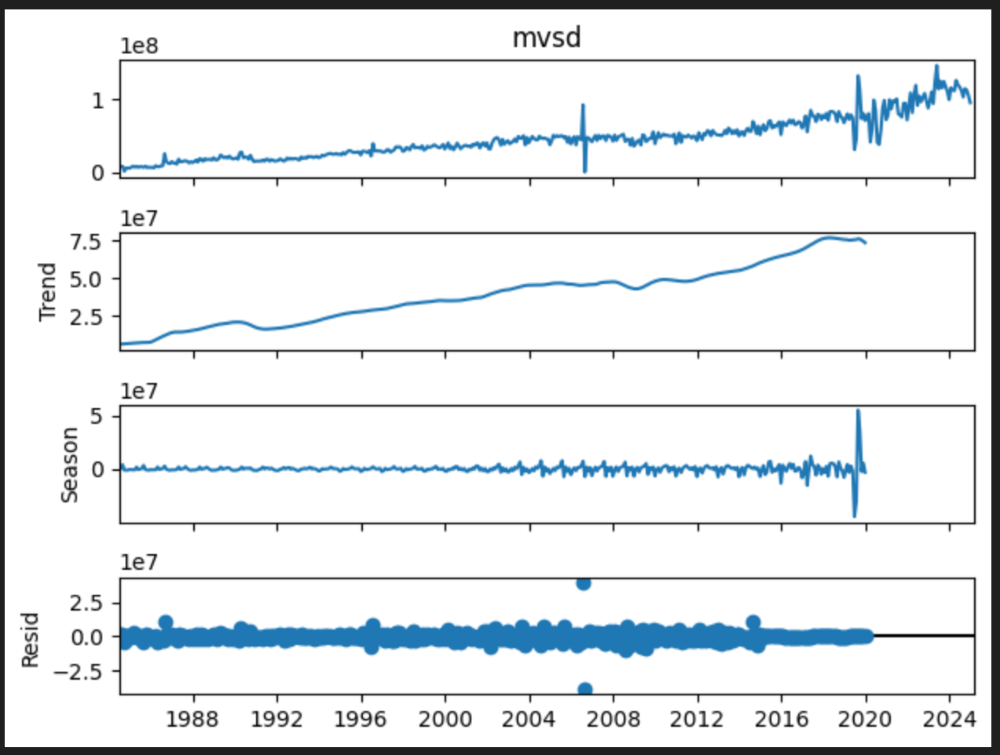
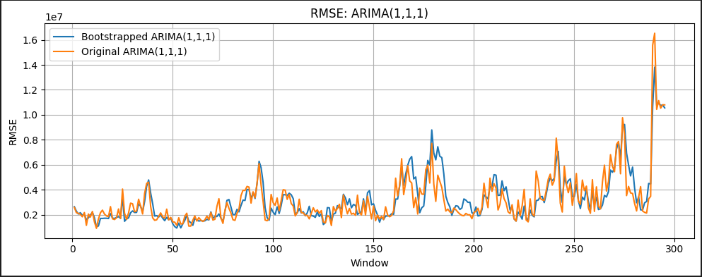
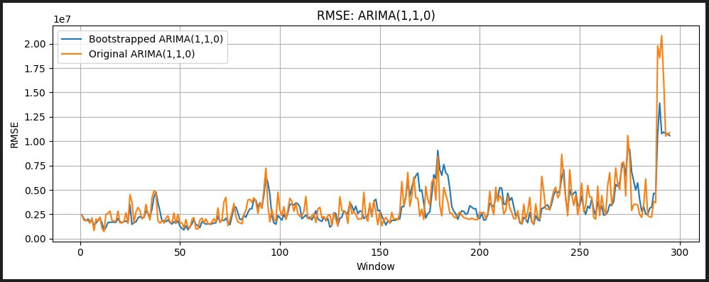
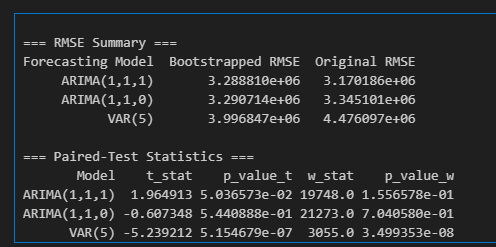

# Bootstrap Bagging for Time-Series Forecasting

A forecasting project investigating whether residual resampling and forecast aggregation can improve out-of-sample accuracy for Motor Vehicle Stamp Duty revenue.

## Models

- ARIMA(1,1,1)
- ARIMA(1,1,0)
- VAR(5)
- Original forecasts vs bootstrapped/bagged forecasts
- Rolling or expanding backtests

## Method

1. Clean the target series and optionally correct pre-identified outliers.
2. Fit STL to each training window.
3. Resample STL residuals to create alternative deseasonalized training series.
4. Fit ARIMA and VAR models to the original and resampled training data.
5. Average forecasts across bootstrap samples.
6. Add the seasonal component back to the forecasts.
7. Evaluate with RMSE, MAE, paired t-tests, and Wilcoxon signed-rank tests.

## Reference visuals from the original run

### STL decomposition



### RMSE comparison: ARIMA(1,1,1)



### RMSE comparison: ARIMA(1,1,0)



### Original results summary



These figures are retained as reference outputs from the earlier implementation. Rerun the cleaned notebook before treating the original numerical results as final.

## Repository structure

```text
bootstrap-forecasting-github-ready/
├── README.md
├── requirements.txt
├── .gitignore
├── data/
│   └── README.md
├── notebooks/
│   └── 01_bootstrap_bagging_forecasting.ipynb
└── figures/
    ├── stl_decomposition_original_run.png
    ├── rmse_arima110_original_run.png
    ├── rmse_arima111_original_run.png
    └── results_summary_original_run.png
```

## Run locally

Create a virtual environment, install the dependencies, place the workbook in `data/`, then launch Jupyter:

```bash
python -m venv .venv
pip install -r requirements.txt
jupyter notebook
```

Open `notebooks/01_bootstrap_bagging_forecasting.ipynb`.

## Reproducibility

The notebook uses one NumPy random-number generator with a fixed seed. Seasonal adjustment is estimated from training data only during the backtest, so the forecast evaluation period is not used to fit STL.

## Data

The Excel workbook is intentionally not included in this template. Only upload it to GitHub if you have permission to publish it.

## Original result pattern

The earlier implementation found the clearest improvement from bagging for VAR(5), while the two ARIMA specifications showed little or mixed improvement.
